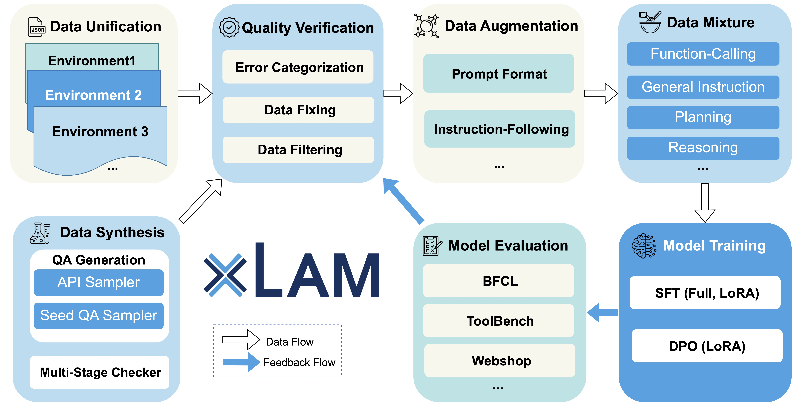
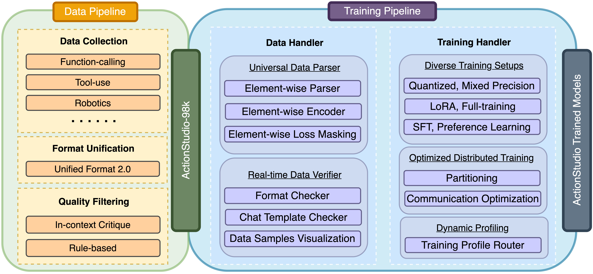
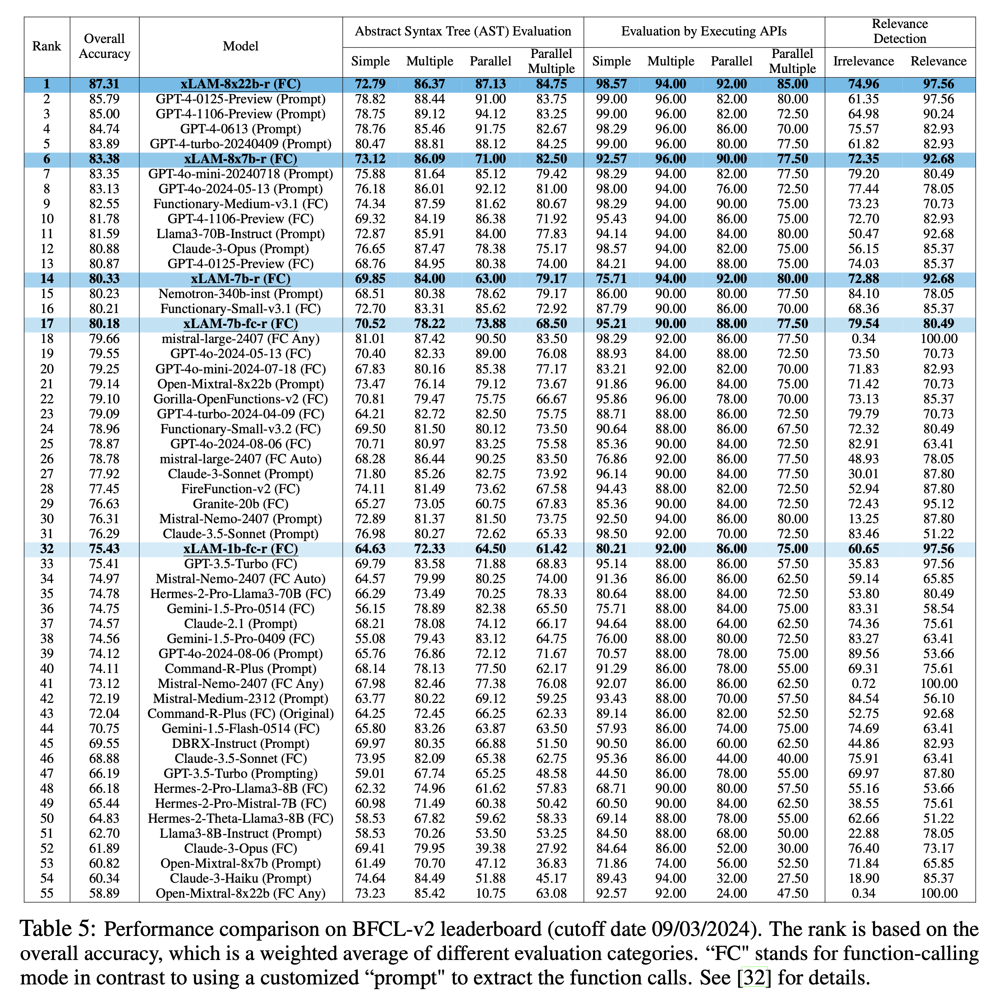

<div align="center">
  <a href="https://github.com/SalesforceAIResearch/xLAM/tree/main"></a>
</div>

<br/>

<div align="center">

  <!-- [](https://github.com/SalesforceAIResearch/xLAM/releases) -->
  
  []()
   [](https://huggingface.co/collections/Salesforce/xlam-models-65f00e2a0a63bbcd1c2dade4)
   [](https://discord.gg/tysWwgZyQ2)
 [](https://star-history.com/#SalesforceAIResearch/xLAM)

</div>

<p align="center">
  <a href="https://arxiv.org/pdf/2409.03215">Paper</a> |
  <!-- <a href="https://github.com/SalesforceAIResearch/AgentLite/tree/main?tab=readme-ov-file#-key-features">Key Features</a> | -->
  <a href="https://github.com/SalesforceAIResearch/xLAM/tree/main?tab=readme-ov-file#model-instruction">Model Instruction</a> |
  <a href="https://github.com/SalesforceAIResearch/xLAM/tree/main?tab=readme-ov-file#framework">Framework</a> |
  <a href="https://github.com/SalesforceAIResearch/xLAM/tree/main?tab=readme-ov-file#installation">Installation</a> |
  <a href="https://github.com/SalesforceAIResearch/xLAM/tree/main?tab=readme-ov-file#train">Train</a> |
  <a href="https://github.com/SalesforceAIResearch/xLAM/tree/main?tab=readme-ov-file#benchmarks">Benchmarks</a> |
  <a href="https://github.com/SalesforceAIResearch/xLAM/tree/main?tab=readme-ov-file#acknowledgement">Acknowledgement</a>
</p>

---

## 🎉🎉🎉 News
- **[08-05.2025]** 💫 [ActionStudio](./actionstudio/README.md) has been updated with new features, improved training configuration tracking, and general code enhancements!
- **[05-12.2025]** Our [xLAM Presentation Slides](https://docs.google.com/presentation/d/1IAdUPSFLd0l05T_IwfcUPI5b_pe0StNFjBd6Srosap8/edit?usp=sharing) for the **NAACL 2025 Oral Session** are now live!   📂 We’ve also open-sourced [**APIGen-MT-5k**](https://huggingface.co/datasets/Salesforce/APIGen-MT-5k) — a compact yet powerful dataset to explore multi-turn function-calling.
- **[04-15.2025]** 🏆🏆🏆 **xLAM-2-fc-r achieves Top-1 performance** on the latest [BFCL Leaderboard](https://gorilla.cs.berkeley.edu/leaderboard.html)!
- **[04-15.2025]**: 🚀🚀🚀 **ActionStudio is now open-source!** Checkout our [paper](https://arxiv.org/abs/2503.22673) and [code](ActionStudio_README.md) for full details.
- **[04-15.2025]**: 📢📢📢 **APIGen-MT is now open-source!** Learn more in our [paper](https://arxiv.org/pdf/2504.03601) and [Project Website](https://apigen-mt.github.io/)!
- **[11.2024]**: Add the [latest examples and tokenizer info](https://huggingface.co/Salesforce/xLAM-8x22b-r/blob/main/example/xlam_chat_template_examples_11_21.ipynb) on interacting with xLAM models. 
- **[09.2024]**: Join our [Discord Community](https://discord.gg/tysWwgZyQ2) if you have any feedbacks!
- **[09.2024]**: Check our xLAM [Technical Report Paper](https://arxiv.org/abs/2409.03215). 
- **[08.2024]**: We are excited to announce the release of full xLAM family, our suite of Large Action Models! From the "tiny giant" to industrial powerhouses.  These models have achieved impressive rankings, placing #1 and #6 on the [Berkeley Function-Calling Leaderboard](https://gorilla.cs.berkeley.edu/leaderboard.html#leaderboard).
Check our [Hugging Face collection](https://huggingface.co/collections/Salesforce/xlam-models-65f00e2a0a63bbcd1c2dade4).
- **[07.2024]**: We are excited to announce the release of our two function-calling models: [xLAM-1b-fc-r](https://huggingface.co/Salesforce/xLAM-1b-fc-r) and [xLAM-7b-fc-r](https://huggingface.co/Salesforce/xLAM-7b-fc-r). These models have achieved impressive rankings, placing #3 and #25 on the [Berkeley Function-Calling Leaderboard](https://gorilla.cs.berkeley.edu/leaderboard.html#leaderboard), outperforming many significantly larger models. Stay tuned for more powerful models coming soon.
- **[06.2024]** Check our latest work [APIGen](https://apigen-pipeline.github.io/), the best open-sourced models for function calling. Our dataset [xlam-function-calling-60k](https://huggingface.co/datasets/Salesforce/xlam-function-calling-60k) is currently among the Top-3 trending datasets on HuggingFace, standing out in a field of 173,670 datasets as of July 4, 2024. See also the [Twitter by Salesforce CEO](https://x.com/Benioff/status/1808365628551844186), [VentureBeat](https://venturebeat.com/ai/salesforce-proves-less-is-more-xlam-1b-tiny-giant-beats-bigger-ai-models/) and [新智元](https://mp.weixin.qq.com/s/B3gyaGwzlQaUXyI8n7Rguw).
- **[03.2024]** [xLAM model](https://huggingface.co/collections/Salesforce/xlam-models-65f00e2a0a63bbcd1c2dade4) is released! Try it together with [AgentLite benchmark](https://github.com/SalesforceAIResearch/AgentLite/tree/main/benchmark) or other benchmarks, which is comparable to GPT-4!
- **[02.2024]** Initial Release of AgentOhana and xLAM [paper](https://arxiv.org/abs/2402.15506)!

---
> **Note**: This repository is provided for **research purposes only**.  
> Any data related to xLAM is **partially released due to internal regulations** to support the advancement of the agent research community.

---

Autonomous agents powered by large language models (LLMs) have garnered significant research attention. However, fully harnessing the potential of LLMs for
agent-based tasks presents inherent challenges due to the heterogeneous nature of
diverse data sources featuring multi-turn trajectories. 

This repo introduces xLAM that aggregates agent trajectories from distinct environments, spanning a wide array of scenarios. It standardizes and unifies these trajectories into a consistent format, streamlining the creation of a generic data loader optimized
for agent training. Leveraging the data unification, our training pipeline maintains
equilibrium across different data sources and preserves independent randomness
across devices during dataset partitioning and model training. 


<p align="center">
    <br>
<!--      -->
    
    <br>
<p>
  
---
  
# Model Instruction

| Model                  | # Total Params | Context Length |Release Date | Category | Download Model  | Download GGUF files |
|------------------------|----------------|------------|-------------|-------|----------------|----------|
| Llama-xLAM-2-70b-fc-r | 70B            | 128k            | Mar. 26, 2025 | Multi-turn Conversation, Function-calling   | [🤗 Link](https://huggingface.co/Salesforce/Llama-xLAM-2-70b-fc-r)         |      NA               |
| Llama-xLAM-2-8b-fc-r      | 8B             | 128k            | Mar. 26, 2025 | Multi-turn Conversation, Function-calling     | [🤗 Link](https://huggingface.co/Salesforce/Llama-xLAM-2-8b-fc-r)              |   [🤗 Link](https://huggingface.co/Salesforce/Llama-xLAM-2-8b-fc-r-gguf)    |
| xLAM-2-32b-fc-r     | 32B            | 32k (max 128k)*            | Mar. 26, 2025 |  Multi-turn Conversation, Function-calling   | [🤗 Link](https://huggingface.co/Salesforce/xLAM-2-32b-fc-r)             |      NA               |
| xLAM-2-3b-fc-r      | 3B             | 32k (max 128k)*            | Mar. 26, 2025 |  Multi-turn Conversation, Function-calling    | [🤗 Link](https://huggingface.co/Salesforce/xLAM-2-3b-fc-r)              |      [🤗 Link](https://huggingface.co/Salesforce/xLAM-2-3b-fc-r-gguf)               |
| xLAM-2-1b-fc-r      | 1B             | 32k (max 128k)*            | Mar. 26, 2025 |  Multi-turn Conversation, Function-calling | [🤗 Link](https://huggingface.co/Salesforce/xLAM-2-1b-fc-r)              |      [🤗 Link](https://huggingface.co/Salesforce/xLAM-2-1b-fc-r-gguf)               |
| xLAM-7b-r           | 7.24B          | 32k            | Sep. 5, 2024|General,  Function-calling | [🤗 Link](https://huggingface.co/Salesforce/xLAM-7b-r) | -- |
| xLAM-8x7b-r           | 46.7B          | 32k           | Sep. 5, 2024|General,  Function-calling | [🤗 Link](https://huggingface.co/Salesforce/xLAM-8x7b-r) | -- |
| xLAM-8x22b-r           | 141B          | 64k           | Sep. 5, 2024|General,  Function-calling | [🤗 Link](https://huggingface.co/Salesforce/xLAM-8x22b-r) | -- |
| xLAM-1b-fc-r           | 1.35B          | 16k           | July 17, 2024 | Function-calling| [🤗 Link](https://huggingface.co/Salesforce/xLAM-1b-fc-r) | [🤗 Link](https://huggingface.co/Salesforce/xLAM-1b-fc-r-gguf) |
| xLAM-7b-fc-r           | 6.91B          | 4k            | July 17, 2024| Function-calling| [🤗 Link](https://huggingface.co/Salesforce/xLAM-7b-fc-r) | [🤗 Link](https://huggingface.co/Salesforce/xLAM-7b-fc-r-gguf) |
| xLAM-v0.1-r           | 46.7B          | 32k            | Mar. 18, 2024 |General,  Function-calling | [🤗 Link](https://huggingface.co/Salesforce/xLAM-v0.1-r) | -- |


[xLAM](https://huggingface.co/collections/Salesforce/xlam-models-65f00e2a0a63bbcd1c2dade4) series are significant better at many things including general tasks and function calling. 
For the same number of parameters, the model have been fine-tuned across a wide range of agent tasks and scenarios, all while preserving the capabilities of the original model.

### 📦 Model Naming Conventions
- `xLAM-7b-r`: A general-purpose v1.0 or v2.0 release of the **Large Action Model**, fine-tuned for broad agentic capabilities. The `-r` suffix indicates it is a **research** release.
- `xLAM-7b-fc-r`: A specialized variant where `-fc` denotes fine-tuning for **function calling** tasks, also marked for **research** use.
- ✅ All models are fully compatible with VLLM, FastChat, and Transformers-based inference frameworks.

---
## Deploying and Interacting with xLAM Models

### 🤗 Use Transformers for Inference
Below is one example on how to use the latest models:

```python
import torch
from transformers import AutoModelForCausalLM, AutoTokenizer

tokenizer = AutoTokenizer.from_pretrained("Salesforce/Llama-xLAM-2-3b-fc-r")
model = AutoModelForCausalLM.from_pretrained("Salesforce/Llama-xLAM-2-3b-fc-r", torch_dtype=torch.bfloat16, device_map="auto")

# Example conversation with a tool call
messages = [
    {"role": "user", "content": "Hi, how are you?"},
    {"role": "assistant", "content": "Thanks. I am doing well. How can I help you?"},
    {"role": "user", "content": "What's the weather like in London?"},
]

tools = [
    {
        "name": "get_weather",
        "description": "Get the current weather for a location",
        "parameters": {
            "type": "object",
            "properties": {
                "location": {"type": "string", "description": "The city and state, e.g. San Francisco, CA"},
                "unit": {"type": "string", "enum": ["celsius", "fahrenheit"], "description": "The unit of temperature to return"}
            },
            "required": ["location"]
        }
    }
]

print("====== prompt after applying chat template ======")
print(tokenizer.apply_chat_template(messages, tools=tools, add_generation_prompt=True, tokenize=False))

inputs = tokenizer.apply_chat_template(messages, tools=tools, add_generation_prompt=True, return_dict=True, return_tensors="pt")
input_ids_len = inputs["input_ids"].shape[-1] # Get the length of the input tokens
inputs = {k: v.to(model.device) for k, v in inputs.items()}
print("====== model response ======")
outputs = model.generate(**inputs, max_new_tokens=256)
generated_tokens = outputs[:, input_ids_len:] # Slice the output to get only the newly generated tokens
print(tokenizer.decode(generated_tokens[0], skip_special_tokens=True))
```

**Note:** You may need to tune the Temperature setting  for different applications. Typically, a lower Temperature is helpful for tasks that require deterministic outcomes. 
Additionally, for tasks demanding adherence to specific formats or function calls, explicitly including formatting instructions is advisable and important. 

### ⚡📈 Using vLLM for Inference

The xLAM models can also be efficiently served using vLLM for high-throughput inference. Please use `vllm>=0.6.5` since earlier versions will cause degraded performance for Qwen-based models.

#### Setup and Serving

1. Install vLLM with the required version:
```bash
pip install "vllm>=0.6.5"
```

2. Download the tool parser plugin to your local path:
```bash
wget https://huggingface.co/Salesforce/xLAM-2-1b-fc-r/raw/main/xlam_tool_call_parser.py
```

3. Start the OpenAI API-compatible endpoint:
```bash
MODEL_NAME_OR_PATH="Salesforce/xLAM-2-1b-fc-r"
ASSIGNED_MODEL_NAME="xlam-2-1b-fc-r" # vLLM uses the assigned model name for reference
NUM_ASSIGNED_GPUS=1 # a 70b model would need 4 GPUs, each with 80GB memory
PORT=8000

vllm serve $MODEL_NAME_OR_PATH \
  --tensor-parallel-size $NUM_ASSIGNED_GPUS \
  --served-model-name $ASSIGNED_MODEL_NAME \
  --port $PORT \
  --gpu-memory-utilization 0.9 \
  --enable-auto-tool-choice \
  --tool-parser-plugin ./xlam_tool_call_parser.py \
  --tool-call-parser xlam 
```

Note: Ensure that the tool parser plugin file is downloaded and that the path specified in `--tool-parser-plugin` correctly points to your local copy of the file. The xLAM series models all utilize the **same** tool call parser, so you only need to download it **once** for all models.

#### Testing with OpenAI API

Here's a minimal example to test tool usage with the served endpoint:

```python
import openai
import json

# Configure the client to use your local vLLM endpoint
client = openai.OpenAI(
    base_url="http://localhost:8000/v1",  # Default vLLM server PORT
    api_key="empty"  # Can be any string
)

# Define a tool/function
tools = [
    {
        "type": "function",
        "function": {
            "name": "get_weather",
            "description": "Get the current weather for a location",
            "parameters": {
                "type": "object",
                "properties": {
                    "location": {
                        "type": "string",
                        "description": "The city and state, e.g. San Francisco, CA"
                    },
                    "unit": {
                        "type": "string",
                        "enum": ["celsius", "fahrenheit"],
                        "description": "The unit of temperature to return"
                    }
                },
                "required": ["location"]
            }
        }
    }
]
messages = [
  {"role": "system", "content": "You are a helpful assistant that can use tools."},
  {"role": "user", "content": "What's the weather like in San Francisco?"}
]

# Create a chat completion
if tools is None or tools==[]: # chitchat
  response = client.chat.completions.create(
      model="xlam-2-1b-fc-r",  # ASSIGNED_MODEL_NAME
      messages=messages
  )
else: # function calling
  response = client.chat.completions.create(
      model="xlam-2-1b-fc-r",  # ASSIGNED_MODEL_NAME
      messages=messages,
      tools=tools,
      tool_choice="auto"
  )

# Print the response
print("Assistant's response:")
print(json.dumps(response.model_dump(), indent=2))
```

For more advanced configurations and deployment options, please refer to the [vLLM documentation](https://docs.vllm.ai/en/latest/serving/openai_compatible_server.html).


---
# 🧠 APIGen-MT: Agentic PIpeline for Multi-Turn Data Generation via Simulated Agent-Human Interplay

<p align="center">


<p>

---

# 🧠 ActionStudio: A Lightweight Framework for Agentic Data and Training of Large Action Models

<p align="center">
    <br>
<!--      -->
    
    <br>
<p>


❤️ Please refer [ActionStudio.md](ActionStudio_README.md) for more details. 


## 📦  Installation

### 🔧 Dependencies

Install dependencies from the root `xLAM` directory (where `setup.py` is located) with:

```bash
conda create --name actionstudio python=3.10

bash requirements.sh
```

### 🚀 Installing ActionStudio

**Development Version** (Latest):

To use the latest code under active development, install ActionStudio in **editable mode** from the root `xLAM` directory (where `setup.py` is located):

```bash
pip install -e .
```

## 🗂️ Structure

```text
actionstudio/
├── datasets/                             # Open-source **`unified trajectory datasets`**
├── examples/                             # Usage examples and configurations
│   ├── data_configs/                     # YAML configs for data mixtures
│   ├── deepspeed_configs/                # DeepSpeed training configuration files
│   └── trainings/                        # Bash scripts for various training methods (**`README.md`**)
├── src/                                  # Source code
│   ├── data_conversion/                  # Converting trajectories into training data (**`README.md`**)
│   └── criticLAM/                        # Critic Large Action Model implementation (**`README.md`**)
└── foundation_modeling/                  # Core modeling components
    ├── data_handlers/
    ├── train/
    ├── trainers/
    └── utils/
```

🔍 Most top-level folders include a **README.md** with detailed instructions and explanations.

## ⚡ Efficiency


## 📜 Licenses

The code is licensed under Apache 2.0, and the datasets are under the CC-BY-NC-4.0 License. The data provided are intended for research purposes only.

## 🛠️ Code Updates History


#### 💫 **Aug 05, 2025**
- **Unified config tracking**
Every run now writes its full training configuration to a single JSON file—keyed by a unique model ID—in [model_config_files](./examples/trainings/model_config_files/) for easy reference and reproducibility.

- **HF ⇄ DeepSpeed parity**
Resolved inconsistencies between Hugging Face and DeepSpeed hyper-parameter settings to ensure they stay perfectly in sync.

- **Learning-rate scheduler tuning**
Refined default scheduler parameters for smoother warm-up and steadier convergence.

- **General code cleanup**
Streamlined modules, removed dead paths, and added inline docs for easier maintenance.


#### **May 09, 2025**
- Fixed argument error in data_verifier. Ref to [#24](https://github.com/SalesforceAIResearch/xLAM/issues/24).

#### **April 14, 2025**
- Updated dependency versions to support the latest models and techniques
- Added auto calculation and assignment of training steps
- Enabled automatic checkpoint merging at the end of training. 
    - 📄 See [actionstudio/examples/trainings/README.md](actionstudio/examples/trainings/README.md) for training examples and usage
- Improved documentation and inline code comments


---
<!-- 
# Deploying and Interacting with xLAM Models

> ⚠️ **Note**: For working with **xLAM v1.0** models, refer to the  [example notebook and tokenizer information](https://huggingface.co/Salesforce/xLAM-8x22b-r/blob/main/example/xlam_chat_template_examples_11_21.ipynb).

**xLAM v2.0** models build upon the v1.0 design with improved structure and follow standard chat formatting, making them directly compatible with popular inference frameworks such as vLLM, Transformers, and more — no special setup required. 
> 🔍 That said, we still recommend reviewing the above notebook for a better understanding of the chat formatting logic and tokenizer behaviors.

## 💬 Serving xLAM as an OpenAI-Compatible Chat API
You can deploy xLAM models as an OpenAI-compatible chat completion API using one of the following two methods.

> 📌 *The example below uses `Salesforce/xLAM-8x7b-r` on a 4×A100 (40GB) setup.*

### Option 1: Using vLLM (Recommended)

vLLM offers efficient serving with lower latency. To serve the model with vLLM:

```bash
vllm serve Salesforce/xLAM-8x7b-r --host 0.0.0.0 --port 8000 --tensor-parallel-size 4
```

### Option 2: Using FastChat

FastChat provides a more feature-rich serving setup. To serve with FastChat:

1. Start the controller:
```bash
python3 -m fastchat.serve.controller --host 0.0.0.0
```

2. Start the OpenAI-compatible API server:
```bash
python3 -m fastchat.serve.openai_api_server --host 0.0.0.0 --port 8000
```

3. Launch the model worker:
```bash
python3 -m fastchat.serve.vllm_worker \
       --model-names "Salesforce/xLAM-8x7b-r" \
       --model-path Salesforce/xLAM-8x7b-r \
       --host 0.0.0.0 \
       --port 31005 \
       --worker-address http://localhost:31001 \
       --num-gpus 4 \
       --limit-worker-concurrency 64
```

## Using the Chat Completion API for xLAM 1.0 Series

Once the model is served, you can use the following xLAM client to interact with it for function calling or other applications:

```python
from xLAM.client import xLAMChatCompletion, xLAMConfig

# Configure the client
config = xLAMConfig(base_url="http://localhost:8000/v1/", model="Salesforce/xLAM-8x7b-r")
llm = xLAMChatCompletion.from_config(config)

# Example conversation
messages = [
    {"role": "system", "content": "You are a helpful assistant."},
    {"role": "user", "content": "What's the weather like in New York?"},
    {"role": "assistant", "content": "To get the weather information for New York, I'll need to use the get_weather function.", "tool_calls": {"name": "get_weather", "arguments": '{"location": "New York", "unit": "fahrenheit"}'}},
    {"role": "tool", "name": "get_weather", "content": '{"temperature": 72, "description": "Partly cloudy"}'},
    {"role": "user", "content": "Now, search for the weather in San Francisco."}
]

# Example function definition (optional)
tools = [
    {
        "name": "get_weather",
        "description": "Get the current weather for a location",
        "parameters": {
            "type": "object",
            "properties": {
                "location": {"type": "string", "description": "The city and state, e.g. San Francisco, New York"},
                "unit": {"type": "string", "enum": ["celsius", "fahrenheit"], "description": "The unit of temperature to return"}
            },
            "required": ["location"]
        }
    },
    {
        "name": "search",
        "description": "Search for information on the internet",
        "parameters": {
            "type": "object",
            "properties": {
                "query": {"type": "string", "description": "The search query, e.g. 'latest news on AI'"}
            },
            "required": ["query"]
        }
    },
    {
        "name": "respond",
        "description": "When you are ready to respond, use this function. This function allows the assistant to formulate and deliver appropriate replies based on the input message and the context of the conversation. Generate a concise response for simple questions, and a more detailed response for complex questions.",
        "parameters": {
            "type": "object",
            "properties": {
                "message": {"type": "string", "description": "The content of the message to respond to."}
            },
            "required": ["message"]
        }
    }
]

response = llm.completion(messages, tools=tools)
print(response)
```
-->

---

# :trophy: Benchmarks (xLAM-2-fc Series)

## Berkeley Function-Calling Leaderboard (BFCL v3)

<p align="left">

</p>

<p align="left">

<br>
<small><i>Performance comparison of different models on BFCL leaderboard. The rank is based on the overall accuracy, which is a weighted average of different evaluation categories. "FC" stands for function-calling mode in contrast to using a customized "prompt" to extract the function calls.</i></small>
</p>

## τ-bench Benchmark

<p align="left">

<br>
<small><i>Success Rate (pass@1) on τ-bench benchmark averaged across at least 5 trials. Our xLAM-2-70b-fc-r model achieves an overall success rate of 56.2% on τ-bench, significantly outperforming the base Llama 3.1 70B Instruct model (38.2%) and other open-source models like DeepSeek v3 (40.6%). Notably, our best model even outperforms proprietary models such as GPT-4o (52.9%) and approaches the performance of more recent models like Claude 3.5 Sonnet (new) (60.1%).</i></small>
</p>

<p align="center">

<br>
<small><i>Pass^k curves measuring the probability that all 5 independent trials succeed for a given task, averaged across all tasks for τ-retail (left) and τ-airline (right) domains. Higher values indicate better consistency of the models.</i></small>
</p>

---

# :trophy: Benchmarks (xLAM 1.0 Series)


## Berkeley Function-Calling Leaderboard (BFCL)

<p align="left">
    <br>
<!--      -->
    
    <br>
<p>

## [BOLAA](https://github.com/salesforce/BOLAA)

### Webshop


<div class="datagrid" style="width:750px;">
<table>
<!-- <thead><tr><th></th><th colspan="6"></th></tr></thead> -->
<thead><tr><th>LLM Name</th><th>ZS</th><th>ZST</th><th>ReaAct</th><th>PlanAct</th><th>PlanReAct</th><th>BOLAA</th></tr></thead>
<tbody>
<tr><td>Llama-2-70B-chat </td><td>0.0089 </td><td>0.0102</td><td>0.4273</td><td>0.2809</td><td>0.3966</td><td>0.4986</td></tr>
<tr><td>Vicuna-33B </td><td>0.1527 </td><td>0.2122</td><td>0.1971</td><td>0.3766</td><td>0.4032</td><td>0.5618</td></tr>
<tr><td>Mixtral-8x7B-Instruct-v0.1 </td><td>0.4634 </td><td>0.4592</td><td><u>0.5638</u></td><td>0.4738</td><td>0.3339</td><td>0.5342</td></tr>
<tr><td>GPT-3.5-Turbo </td><td>0.4851 </td><td><u>0.5058</u></td><td>0.5047</td><td>0.4930</td><td><u>0.5436</u></td><td><u>0.6354</u></td></tr>
<tr><td>GPT-3.5-Turbo-Instruct </td><td>0.3785 </td><td>0.4195</td><td>0.4377</td><td>0.3604</td><td>0.4851</td><td>0.5811</td></tr>
<tr><td>GPT-4-0613</td><td><u>0.5002</u></td><td>0.4783 </td><td>0.4616</td><td><strong>0.7950</strong></td><td>0.4635</td><td>0.6129</td></tr>
<tr><td>xLAM-v0.1-r</td><td><strong>0.5201</strong></td><td><strong>0.5268</strong></td><td><strong>0.6486</strong></td><td><u>0.6573</u></td><td><strong>0.6611</strong></td><td><strong>0.6556</strong></td></tr>
</tbody>
</table>

### HotpotQA

<div class="datagrid" style="width:750px;">
<table>
<!-- <thead><tr><th></th><th colspan="6"></th></tr></thead> -->
<thead><tr><th>LLM Name</th><th>ZS</th><th>ZST</th><th>ReaAct</th><th>PlanAct</th><th>PlanReAct</th></thead>
<tbody>
<tr><td>Mixtral-8x7B-Instruct-v0.1 </td><td>0.3912 </td><td>0.3971</td><td>0.3714</td><td>0.3195</td><td>0.3039</td></tr>
<tr><td>GPT-3.5-Turbo </td><td>0.4196 </td><td>0.3937</td><td>0.3868</td><td>0.4182</td><td>0.3960</td></tr>
<tr><td>GPT-4-0613</td><td><strong>0.5801</strong></td><td><strong>0.5709 </strong></td><td><strong>0.6129</strong></td><td><strong>0.5778</strong></td><td><strong>0.5716</strong></td></tr>
<tr><td>xLAM-v0.1-r</td><td><u>0.5492</u></td><td><u>0.4776</u></td><td><u>0.5020</u></td><td><u>0.5583</u></td><td><u>0.5030</u></td></tr>
</tbody>
</table>

## [AgentLite](https://github.com/SalesforceAIResearch/AgentLite/tree/main)

**Please note:** All prompts provided by AgentLite are considered "unseen prompts" for xLAM-v0.1-r, meaning the model has not been trained with data related to these prompts.

#### Webshop 

<div class="datagrid" style="width:780px;">
<table>
<!-- <thead><tr><th></th><th colspan="2">Easy</th><th colspan="2">Medium</th><th colspan="2">Hard</th></tr></thead> -->
<thead><tr><th>LLM Name</th><th>Act</th><th>ReAct</th><th>BOLAA</th></tr></thead>
<tbody>
<tr><td>GPT-3.5-Turbo-16k </td><td>0.6158 </td><td>0.6005</td><td>0.6652</td></tr>
<tr><td>GPT-4-0613</td><td><strong>0.6989 </strong></td><td><strong>0.6732</strong></td><td><strong>0.7154</strong></td></tr>
<tr><td>xLAM-v0.1-r</td><td><u>0.6563</u></td><td><u>0.6640</u></td><td><u>0.6854</u></td></tr>
</tbody>
</table>

#### HotpotQA

<div class="datagrid" style="width:700px;">
<table>
<thead><tr><th></th><th colspan="2">Easy</th><th colspan="2">Medium</th><th colspan="2">Hard</th></tr></thead>
<thead><tr><th>LLM Name</th><th>F1 Score</th><th>Accuracy</th><th>F1 Score</th><th>Accuracy</th><th>F1 Score</th><th>Accuracy</th></tr></thead>
<tbody>
<tr><td>GPT-3.5-Turbo-16k-0613 </td><td>0.410 </td><td>0.350</td><td>0.330</td><td>0.25</td><td>0.283</td><td>0.20</td></tr>
<tr><td>GPT-4-0613</td><td><strong>0.611</strong></td><td><strong>0.47</strong> </td><td><strong>0.610</strong></td><td><strong>0.480</strong></td><td><strong>0.527</strong></td><td><strong>0.38</strong></td></tr>
<tr><td>xLAM-v0.1-r</td><td><u>0.532</u></td><td><u>0.45</u></td><td><u>0.547</u></td><td><u>0.46</u></td><td><u>0.455</u></td><td><u>0.36</u></td></tr>
</tbody>
</table>


## [ToolBench](https://github.com/OpenBMB/ToolBench)

<div class="datagrid" style="width:780px;">
<table>
<!-- <thead><tr><th></th><th colspan="2">Easy</th><th colspan="2">Medium</th><th colspan="2">Hard</th></tr></thead> -->
<thead><tr><th>LLM Name</th><th>Unseen Insts & Same Set</th><th>Unseen Tools & Seen Cat</th><th>Unseen Tools & Unseen Cat</th></tr></thead>
<tbody>
<tr><td>TooLlama V2 </td><td>0.4385 </td><td>0.4300</td><td>0.4350</td></tr>
<tr><td>GPT-3.5-Turbo-0125 </td><td>0.5000 </td><td>0.5150</td><td>0.4900</td></tr>
<tr><td>GPT-4-0125-preview</td><td><strong>0.5462</strong></td><td><u>0.5450</u></td><td><u>0.5050</u></td></tr>
<tr><td>xLAM-v0.1-r</td><td><u>0.5077</u></td><td><strong>0.5650</strong></td><td><strong>0.5200</strong></td></tr>
</tbody>
</table>

## [MINT-BENCH](https://github.com/xingyaoww/mint-bench)


<div class="datagrid" style="width:700px;">
<table>
<!-- <thead><tr><th></th><th colspan="2">Easy</th><th colspan="2">Medium</th><th colspan="2">Hard</th></tr></thead> -->
<thead><tr><th>LLM Name</th><th>1-step</th><th>2-step</th><th>3-step</th><th>4-step</th><th>5-step</th></tr></thead>
<tbody>
<tr><td>GPT-4-0613</td><td>-</td><td>-</td><td>-</td><td>-</td><td>69.45</td></tr>
<tr><td>Claude-Instant-1</td><td>12.12</td><td>32.25</td><td>39.25</td><td>44.37</td><td>45.90</td></tr>
<tr><td>xLAM-v0.1-r</td><td>4.10</td><td>28.50</td><td>36.01</td><td>42.66</td><td>43.96</td></tr>
<tr><td>Claude-2 </td><td>26.45 </td><td>35.49</td><td>36.01</td><td>39.76</td><td>39.93</td></tr>
<tr><td>Lemur-70b-Chat-v1 </td><td>3.75 </td><td>26.96</td><td>35.67</td><td>37.54</td><td>37.03</td></tr>
<tr><td>GPT-3.5-Turbo-0613 </td><td>2.73</td><td>16.89</td><td>24.06</td><td>31.74</td><td>36.18</td></tr>
<tr><td>AgentLM-70b </td><td>6.48</td><td>17.75</td><td>24.91</td><td>28.16</td><td>28.67</td></tr>
<tr><td>CodeLlama-34b </td><td>0.17</td><td>16.21</td><td>23.04</td><td>25.94</td><td>28.16</td></tr>
<tr><td>Llama-2-70b-chat </td><td>4.27</td><td>14.33</td><td>15.70</td><td>16.55</td><td>17.92</td></tr>
</tbody>
</table>


## [Tool-Query](https://github.com/hkust-nlp/AgentBoard)

<div class="datagrid" style="width:700px;">
<table>
<!-- <thead><tr><th></th><th colspan="2">Easy</th><th colspan="2">Medium</th><th colspan="2">Hard</th></tr></thead> -->
<thead><tr><th>LLM Name</th><th>Success Rate</th><th>Progress Rate</th></tr></thead>
<tbody>
<tr><td>xLAM-v0.1-r</td><td><strong>0.533</strong></td><td><strong>0.766</strong></td></tr>
<tr><td>DeepSeek-67B </td><td>0.400 </td><td>0.714</td></tr>
<tr><td>GPT-3.5-Turbo-0613 </td><td>0.367 </td><td>0.627</td></tr>
<tr><td>GPT-3.5-Turbo-16k </td><td>0.317</td><td>0.591</td></tr>
<tr><td>Lemur-70B </td><td>0.283</td><td>0.720</td></tr>
<tr><td>CodeLlama-13B </td><td>0.250</td><td>0.525</td></tr>
<tr><td>CodeLlama-34B </td><td>0.133</td><td>0.600</td></tr>
<tr><td>Mistral-7B </td><td>0.033</td><td>0.510</td></tr>
<tr><td>Vicuna-13B-16K </td><td>0.033</td><td>0.343</td></tr>
<tr><td>Llama-2-70B </td><td>0.000</td><td>0.483</td></tr>
</tbody>
</table>

---
# Licenses

This code is licensed under Apache 2.0.  For models based on the [deepseek model](https://huggingface.co/collections/deepseek-ai/deepseek-coder-65f295d7d8a0a29fe39b4ec4), which require you to follow the use based restrictions in the [linked deepseek license](https://github.com/deepseek-ai/deepseek-coder/blob/main/LICENSE-MODEL). This is a research only project.


---

# Acknowledgement

We want to acknowledge the work which have made contributions to our paper and the agent research community! If you find our work useful, please consider to cite

```bibtex
@article{zhang2024xlamfamilylargeaction,
  title={xLAM: A Family of Large Action Models to Empower AI Agent Systems}, 
  author={Zhang, Jianguo  and Lan, Tian  and Zhu, Ming  and Liu, Zuxin and Hoang, Thai and Kokane, Shirley and Yao, Weiran and Tan, Juntao and Prabhakar, Akshara and Chen, Haolin and Liu, Zhiwei and Feng, Yihao and Awalgaonkar, Tulika and Murthy, Rithesh and Hu, Eric and Chen, Zeyuan and Xu, Ran and Niebles, Juan Carlos and Heinecke, Shelby and Wang, Huan and Savarese, Silvio and Xiong, Caiming},
  journal={arXiv preprint arXiv:2409.03215}
  year={2024}
}
```

```bibtex
@article{zhang2025actionstudio,
  title={ActionStudio: A Lightweight Framework for Data and Training of Action Models},
  author={Zhang, Jianguo and Hoang, Thai and Zhu, Ming and Liu, Zuxin and Wang, Shiyu and Awalgaonkar, Tulika and Prabhakar, Akshara and Chen, Haolin and Yao, Weiran and Liu, Zhiwei and others},
  journal={arXiv preprint arXiv:2503.22673},
  year={2025}
}
```

```bibtex
@article{prabhakar2025apigen,
  title={APIGen-MT: Agentic PIpeline for Multi-Turn Data Generation via Simulated Agent-Human Interplay},
  author={Prabhakar, Akshara and Liu, Zuxin and Zhu, Ming and Zhang, Jianguo and Awalgaonkar, Tulika and Wang, Shiyu and Liu, Zhiwei and Chen, Haolin and Hoang, Thai and others},
  journal={arXiv preprint arXiv:2504.03601},
  year={2025}
}
```

```bibtex
@article{liu2024apigen,
  title={APIGen: Automated PIpeline for Generating Verifiable and Diverse Function-Calling Datasets},
  author={Liu, Zuxin and Hoang, Thai and Zhang, Jianguo and Zhu, Ming and Lan, Tian and Kokane, Shirley and Tan, Juntao and Yao, Weiran and Liu, Zhiwei and Feng, Yihao and others},
  journal={arXiv preprint arXiv:2406.18518},
  year={2024}
}
```

```bibtex
@article{zhang2024agentohana,
  title={AgentOhana: Design Unified Data and Training Pipeline for Effective Agent Learning},
  author={Zhang, Jianguo and Lan, Tian and Murthy, Rithesh and Liu, Zhiwei and Yao, Weiran and Tan, Juntao and Hoang, Thai and Yang, Liangwei and Feng, Yihao and Liu, Zuxin and others},
  journal={arXiv preprint arXiv:2402.15506},
  year={2024}
}
```
